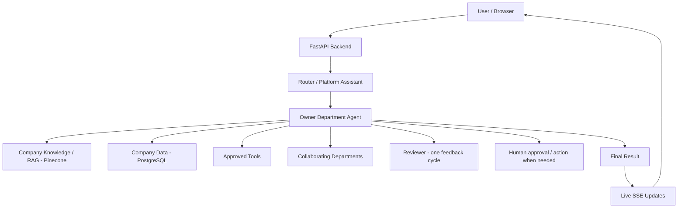

# Orchestra

<p align="center">
  
</p>

**Orchestra** is a generalized, multi-tenant enterprise multi-agent platform that routes internal and external business requests through specialized AI-powered departments. Companies register, onboard their operational data, and let department agents — grounded in company knowledge via RAG — answer questions, make policy-based decisions, collaborate across teams, and request human approval only when truly necessary.

> **Status:** v1.0 · Feature-based modular monolith · 5 predefined departments · 590+ passing tests

---

## Table of Contents

- [Overview](#overview)
- [Key Capabilities](#key-capabilities)
- [Architecture](#architecture)
- [Technology Stack](#technology-stack)
- [Repository Structure](#repository-structure)
- [Getting Started](#getting-started)
- [Configuration](#configuration)
- [Testing](#testing)
- [Documentation](#documentation)
- [Security & Multi-Tenancy](#security--multi-tenancy)
- [Known Limitations](#known-limitations)
- [Changelog](#changelog)
- [Contributing](#contributing)

---

## Overview

Orchestra is a hosted, multi-tenant SaaS that lets organizations automate everyday enterprise workflows through specialized AI departments. A registered company provides its own data — employees, budgets, assets, suppliers, policies, manuals — and department agents use that company-specific knowledge to:

- answer questions and retrieve policies;
- make policy-based decisions;
- execute approved database operations;
- collaborate with other departments;
- request human approval or action only when necessary;
- track requests from creation to completion with live updates.

### Supported Departments (v1)

| Department | Primary Focus |
|------------|---------------|
| Customer Support | External user inquiries and support workflows |
| Human Resources | Employee lifecycle, leave, staffing, policies |
| Information Technology | Access, assets, software, technical operations |
| Finance | Budgets, approvals, financial decisions |
| Procurement | Suppliers, purchasing, vendor coordination |

Each department has its own prompt, boundaries, tool access, permissions, and collaboration behavior, while sharing the same platform workflow and request lifecycle.

### Main Actors

- **Company account** — configures the organization, uploads data/documents, reviews capability gaps and failures.
- **External user** — interacts mainly with Customer Support.
- **Employee** — submits internal requests and asks department-specific questions.
- **Department manager** — creates/monitors requests, approves or rejects when required, confirms human actions.

---

## Key Capabilities

- **Multi-tenant isolation** — every tenant-owned record is scoped by `company_id`; repositories are dependency-injected and tenant-scoped.
- **Business request lifecycle** — create, route, track, cancel, and complete with one Request ID from creation to termination (no sub-requests).
- **Centralized LangGraph workflow** — router, department execution, collaboration, reviewer, human action, completion, and terminal failure nodes with versioned Pydantic checkpoints.
- **RAG-powered answers** — document upload, chunking, ingestion, and search via Pinecone with tenant-scoped namespaces.
- **Human-in-the-loop checkpoints** — manager/company-account authorization, decision packaging, and structured response forms.
- **Live updates via SSE** — request events and notifications with heartbeat, `Last-Event-ID` replay, and permission-filtered visibility.
- **Company onboarding** — structured wizard with import validation, manager assignment, and activation.
- **Failure handling** — capability-gap reporting and terminal failure logging with safe (sanitized) error propagation.
- **18-resource admin API** — company profile, employees, departments, assets, software, budgets, leave, holidays, staffing rules, suppliers, policies, and more.

---

## Architecture



**Design principles (v1):**

- One owner department per business request.
- One centralized LangGraph graph (no per-department subgraphs).
- One shared PostgreSQL schema with `company_id` scoping.
- One Pinecone index with one namespace per company.
- Workflow state persisted outside the LLM; department agents are stateless.
- Structured inter-department communication (no permanent message storage).
- Minimum human effort — agents complete all possible research before involving a human.
- Feature-based modular monolith (no microservices in v1).

---

## Technology Stack

| Layer | Technology |
|-------|-----------|
| Frontend | React 18, TypeScript, Vite, Tailwind CSS, Framer Motion, TanStack Query, Zustand, React Hook Form, React Router |
| Backend | Python 3.11+, FastAPI, Pydantic v2, SQLAlchemy 2.0 (async), Alembic |
| Orchestration | LangGraph, LangChain |
| Relational DB | Neon hosted PostgreSQL (`postgresql+asyncpg`) |
| Vector DB | Pinecone (tenant-scoped namespaces) |
| LLM | Groq-hosted models (configurable) |
| Real-time | Server-Sent Events |
| Auth | JWT (HS256), Argon2 password hashing via pwdlib |
| Testing | pytest, pytest-asyncio (backend); Vitest, Testing Library (frontend) |

---

## Repository Structure

```
NCS-HACK-3/
├── AGENTS.md                  # Codex/agent instructions
├── README.md                  # This file
├── CHANGELOG.md               # Version history
├── FILE_MANIFEST.md           # Tracked-file manifest
├── docs/                      # Authoritative specification (20 docs + decisions)
│   ├── 01-system-overview.md
│   ├── ...
│   └── 20-launch-package.md
├── examples/                  # Ready-to-use mock data for testing
│   └── onboarding-data/       # Signup values, CSVs, policy documents
├── backend/                   # FastAPI modular monolith
│   ├── app/
│   │   ├── main.py            # App factory, lifespan, routers
│   │   ├── core/              # Config, settings, enums
│   │   ├── auth/              # Registration, login, tokens, passwords
│   │   ├── companies/         # Tenant management
│   │   ├── users/ employees/  # User & employee domains
│   │   ├── departments/       # 5 department modules + registry
│   │   ├── requests/          # Business request lifecycle
│   │   ├── workflow/          # LangGraph graph, nodes, routing, state
│   │   ├── rag/               # Document upload, ingestion, search
│   │   ├── realtime/          # SSE streams
│   │   ├── notifications/     # Notifications + SSE
│   │   ├── human_actions/     # HITL actions
│   │   ├── onboarding/        # Company onboarding & import
│   │   ├── admin/             # 18-resource admin CRUD
│   │   ├── dashboard/         # Role-specific dashboards
│   │   ├── failures/          # Capability gaps & terminal failures
│   │   ├── assistant/         # Router / platform assistant
│   │   ├── llm/               # LLM client wrappers
│   │   └── database/          # Engine, session, models, health
│   ├── alembic/               # Migrations
│   ├── scripts/seed_demo.py   # Interactive demo seeder (dev/test only)
│   ├── tests/                 # 133 test files, 590+ tests
│   ├── pyproject.toml
│   ├── alembic.ini
│   └── pytest.ini
└── frontend/                  # React + TypeScript UI
    ├── src/
    │   ├── app/               # Layout, shell, pages, router, providers
    │   ├── api/               # Typed API client + hooks
    │   ├── auth/              # Auth flows
    │   ├── dashboard/         # Role dashboards
    │   ├── requests/          # Request UI
    │   ├── human-action/      # HITL components
    │   ├── notifications/     # Notifications UI
    │   ├── onboarding/        # Onboarding wizard
    │   ├── realtime/          # SSE hooks
    │   ├── components/        # Shared UI components
    │   ├── design/            # Design system, tokens, theme
    │   ├── hooks/ lib/ utils/ types/ motion/
    │   └── test/              # Test setup
    ├── package.json
    ├── vite.config.ts
    ├── vitest.config.ts
    └── tailwind.config.js
```

---

## Getting Started

### Prerequisites

- **Python 3.11+** (via Conda recommended)
- **Node.js 18+** and npm
- A **Neon PostgreSQL** database (pooled + direct connection strings)
- A **Pinecone** account and API key
- A **Groq** API key

### 1. Configure environment files

Copy the example env files and fill in your secrets:

```powershell
# Backend
copy backend\.env.example backend\.env
# Edit backend\.env — set DATABASE_URL, ALEMBIC_DATABASE_URL, JWT_SECRET_KEY, GROQ_API_KEY, PINECONE_API_KEY

# Frontend
copy frontend\.env.example frontend\.env
# Edit frontend\.env — set VITE_API_BASE_URL if needed
```

### 2. Run the backend

Use the existing Conda environment (recommended):

```powershell
cd backend
conda run -n dev python -m alembic upgrade head
conda run -n dev python -m uvicorn app.main:app --reload
```

The API will be available at `http://127.0.0.1:8000`. Swagger docs at `/docs`, health at `/health`, readiness at `/ready`.

### 3. Run the frontend

In a second terminal:

```powershell
cd frontend
npm install
npm run dev
```

Open `http://localhost:5173/`.

### 4. (Optional) Seed demo data

The interactive seed script is blocked outside development/test environments and creates no fixed password:

```powershell
cd backend
conda run -n dev python scripts/seed_demo.py
```

### First-run flow

A **Company account** can register publicly and is then directed through onboarding before activation. Employees and department managers are provisioned by a Company account; external users use the approved provisioning flow. Those roles do not have unrestricted public signup.

### 5. Use the example onboarding data (recommended for testing)

The `examples/onboarding-data/` folder contains ready-to-use mock data (CSV spreadsheets + policy documents) for a fictional company called **Northstar Labs**. It lets you complete the full signup → onboarding → activation flow in minutes:

1. Sign up with the values from `examples/onboarding-data/00_company_signup.json`.
2. Upload `01_departments.csv` in the Departments step.
3. Upload `02_employees.csv` in the Employees step.
4. Upload `03_manager_assignments.csv` in the Managers step.
5. Upload the policy documents from `examples/onboarding-data/policies/` in the Policies step.
6. Activate the company.

See `examples/onboarding-data/README.md` for full instructions, column references, and demo credentials.

---

## Configuration

### Backend (`backend/.env`)

| Variable | Description | Required |
|----------|-------------|----------|
| `DATABASE_URL` | Neon pooled PostgreSQL asyncpg URL | ✅ |
| `ALEMBIC_DATABASE_URL` | Neon direct PostgreSQL asyncpg URL (for migrations) | ✅ |
| `JWT_SECRET_KEY` | JWT signing secret | ✅ |
| `GROQ_API_KEY` | Groq LLM API key | ✅ |
| `PINECONE_API_KEY` | Pinecone vector DB API key | ✅ |
| `PINECONE_INDEX_HOST` | Pinecone index host URL | For hosted indexes |
| `CORS_ORIGINS` | Comma-separated allowed frontend origins | ✅ |
| `APP_ENV` | `development` / `test` / `staging` / `production` | ✅ |
| `JWT_ALGORITHM` | JWT algorithm (HS256/HS384/HS512) | Default `HS256` |
| `GROQ_MODEL_*` | Router/fast/reasoning/reviewer model names | Defaults provided |
| `RAG_*` | Chunk size, overlap, top-k | Defaults provided |
| `WORKFLOW_*` | Collaboration depth, retries, revisions | Defaults provided |

See `backend/.env.example` for the full list with defaults.

### Frontend (`frontend/.env`)

| Variable | Description | Default |
|----------|-------------|---------|
| `VITE_API_BASE_URL` | Backend API base URL | `http://localhost:8000/api/v1` |
| `VITE_APP_ENV` | Environment label | `development` |

> ⚠️ Never place backend secrets in `frontend/.env` — it is public browser configuration only.

---

## Testing

### Backend

```powershell
cd backend
conda run -n dev python -m pytest
```

- 133 test files, 590+ passing tests across all domains.
- Covers auth, business requests, workflow, collaboration, RAG, admin, onboarding, notifications, SSE, capability gaps, and more.
- Config in `backend/pytest.ini` (`testpaths = ["tests"]`, `pythonpath = ["."]`).

### Frontend

```powershell
cd frontend
npm run test      # vitest run
npm run lint      # eslint
npm run build     # tsc -b && vite build
```

---

## Documentation

The full system specification and implementation guidance live in `docs/`. These documents are the **source of truth** — do not silently replace an accepted decision with a different architecture.

**Recommended reading order:**

1. `docs/01-system-overview.md`
2. `docs/02-actors-and-departments.md`
3. `docs/03-business-rules-and-request-lifecycle.md`
4. `docs/04-ai-multi-agent-architecture.md`
5. `docs/05-technology-stack.md`
6. `docs/06-backend-architecture.md`
7. `docs/07-langgraph-workflow-architecture.md`
8. `docs/08-database-architecture.md`
9. `docs/09-rag-company-knowledge.md`
10. `docs/10-api-architecture.md`
11. `docs/11-realtime-request-tracking.md`
12. `docs/12-frontend-architecture.md`
13. `docs/13-company-onboarding-data-import.md`
14. `docs/14-auth-permissions-multitenancy.md`
15. `docs/15-failure-handling-notifications.md`
16. `docs/16-deployment-architecture.md`
17. `docs/17-future-improvements.md`
18. `docs/18-codex-implementation-instructions.md`
19. `docs/19-uat-plan.md`
20. `docs/20-launch-package.md`

Architecture decisions are summarized in `docs/decisions/architecture-decisions.md`.

---

## Security & Multi-Tenancy

- **Tenant isolation** — all tenant-owned database access is scoped to the authenticated `company_id` via dependency-injected repositories.
- **No tokens in localStorage** — sessionStorage only; tokens cleared on logout and session cleanup.
- **Automatic token refresh** on 401 (one attempt) with secure storage.
- **Error normalization** — backend exceptions are never leaked to clients; safe, human-friendly messages only.
- **Backend-enforced authorization** — the frontend never relies on `is_staff` / `is_department_manager` flags for access control.
- **No `dangerousSetInnerHTML`** usages in frontend code.
- **Prohibited-value scanning** in workflow state (JWT, credentials, private keys, DB URLs).
- **Argon2** password hashing via pwdlib.
- **CORS** restricted to configured frontend origins only.

---

## Known Limitations

| Limitation | Impact | Planned Resolution |
|-----------|--------|-------------------|
| Single centralized LangGraph graph | All traffic routed through one graph instance | v2: graph federation per department |
| No real-time collaboration editing | Managers cannot edit requests simultaneously | v2: operational transforms / Yjs |
| Change password does not revoke sessions | Old tokens remain valid until expiry | v2: token rotation on password change |
| Frontend does not retry SSE on 401 | User may miss updates after token expiry | v2: reconnect with refreshed token |
| v1 supports only 5 predefined departments | Companies cannot create custom department types | Future: extensible department registry |

See `docs/17-future-improvements.md` for the full roadmap.

---

## Changelog

See [CHANGELOG.md](CHANGELOG.md) for the full version history.

---

## Contributing

This project follows the working method defined in `AGENTS.md`:

1. Read the relevant specification in `docs/`.
2. Summarize the requirement and affected modules.
3. Identify conflicts or missing decisions before coding.
4. Propose a small implementation plan.
5. Implement incrementally.
6. Add tests for important behavior.
7. Run tests, linting, and type checks.
8. Report what changed and any remaining limitations.

**Definition of Done:** follows architecture documents · tenant isolation preserved · failure cases handled · relevant tests pass · migrations included for schema changes · API schemas typed · no secrets committed · documentation updated when behavior changes.

> Do not implement unrelated functionality. Do not add extra databases, microservices, agents, selectors, or infrastructure unless a documented requirement needs them.
