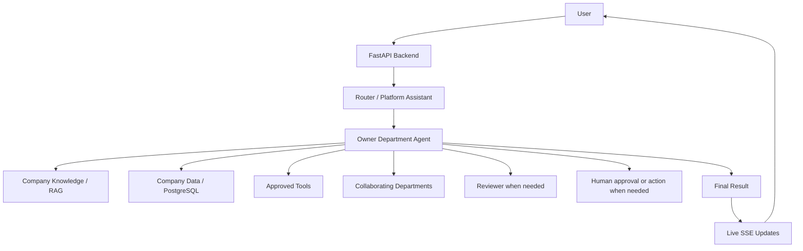

# 1. System Overview

## 1.1 Purpose

The Enterprise Multi-Agent Platform is a generalized web application that allows companies to automate internal and external business requests through specialized AI-powered departments.

A registered company provides its own operational data, policies, manuals, employee information, budgets, hardware inventory, supplier information, and other relevant documents. Department agents use that company-specific information to:

- answer questions;
- retrieve policies and operational data;
- make policy-based decisions;
- execute approved database operations;
- collaborate with other departments;
- request human approval or action only when necessary;
- track requests from creation to completion.

## 1.2 Product Model

The product is a multi-tenant hosted platform.

Many companies can register and use the same application, but each company's data, documents, requests, users, budgets, assets, and knowledge must remain isolated.

Version 1 uses one hosted PostgreSQL database with a shared schema. Every tenant-owned record is linked to a `company_id`.

## 1.3 Supported Departments

Version 1 supports only:

1. Customer Support
2. Human Resources
3. Information Technology
4. Finance
5. Procurement

Companies cannot create completely new department types in Version 1.

## 1.4 Main Actors

- **Company account:** configures the organization, uploads data and documents, reviews capability gaps and failures, and manages company-wide information.
- **External user:** interacts mainly with Customer Support.
- **Employee:** submits internal requests and asks department-specific questions.
- **Department manager:** creates and monitors requests, approves or rejects when required, confirms human actions, and manages permitted department data.

## 1.5 Core Request Flow

## 1.6 Core Product Principles

- One owner department per business request.
- One Request ID from creation to termination.
- No sub-requests.
- Dynamic agent planning with mandatory checkpoints.
- Persistent workflow state outside the LLM.
- Stateless department agents.
- Structured inter-department communication.
- Minimum human effort.
- Explainable important decisions.
- Graceful failure handling.
- Role-based visibility.
- Hosted managed infrastructure.
- Simple Version 1 architecture with room for future extension.
