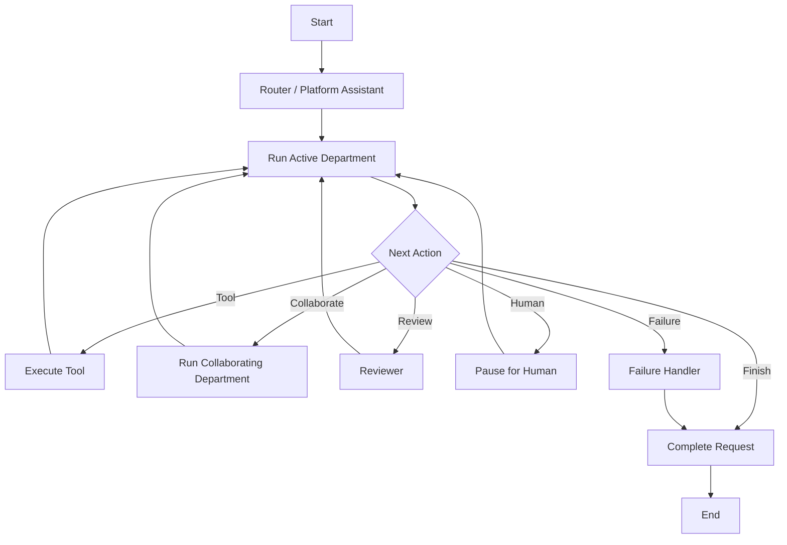

# 7. LangGraph Workflow Architecture

## 7.1 One Centralized Graph

Version 1 uses one platform-level LangGraph graph.

The graph is not divided into department subgraphs.

Department code remains modular, but runtime orchestration is centralized.

## 7.2 Ownership

```text
workflow/
→ owns graph, state, nodes, routing, persistence, reviewer flow,
  human pauses, failures, and completion

departments/
→ own prompts, agents, tools, services, and repositories
```

## 7.3 Recommended Structure

```text
workflow/
├── graph.py
├── state.py
├── routing.py
├── persistence.py
└── nodes/
    ├── router.py
    ├── departments.py
    ├── reviewer.py
    ├── human_action.py
    ├── failure.py
    └── completion.py
```

## 7.4 Conceptual Graph



## 7.5 Shared Workflow State

Use one state object organized into sections:

```python
class WorkflowState(TypedDict, total=False):
    request: dict
    planning: dict
    collaboration: dict
    execution: dict
    review: dict
    human_action: dict
    failure: dict
    result: dict
```

### Request Section

- Request ID
- Company ID
- Requester ID
- owner department
- active department
- request type
- current status
- original request summary

### Planning Section

- initial plan
- revised plan
- completed steps
- pending steps
- current step

### Collaboration Section

- current structured message
- collaborating department
- expected output
- latest collaboration result

Temporary collaboration messages are discarded when no longer needed.

### Execution Section

- relevant tool results
- important retrieved evidence references
- timestamps
- retry information

### Review Section

- review required
- package
- feedback
- feedback used
- revision completed

### Human Action Section

- required
- action type
- assigned user or manager
- decision package
- current status
- human response

### Failure Section

- failure type
- internal detail
- user-safe reason
- alternative attempted
- terminal decision

### Result Section

- decision
- reason
- final response
- completion metadata

## 7.6 Persistence

Persist business-critical state in PostgreSQL.

Do not persist:

- hidden chain of thought;
- raw prompts;
- unnecessary intermediate drafts;
- duplicated retrieval chunks;
- temporary formatting values.

Persist:

- lifecycle;
- plans;
- completed stages;
- important tool results;
- collaboration outcomes;
- review feedback;
- human action;
- failure;
- final result.

## 7.7 Pause and Resume

Human approval and action nodes pause workflow execution.

The request can resume later using its persisted state.

Backend restarts must not lose business-critical progress.

## 7.8 Adaptive Planning

Agents generate an initial high-level plan.

They may modify future steps after each important event.

The graph controls persistence and transitions; the agent decides appropriate next actions within policy and tool boundaries.
## Customer Support pause paths

The centralized graph supports three Step 13 Customer Support outcomes in addition to completion:
`wait_for_user_input` pauses for one clarification, collaboration prepares an IT diagnostic handoff,
and human action prepares an authorized escalation. These paths preserve the original Request ID,
owner department, and checkpointed state. They do not execute IT work or human actions.

## IT graph behavior

The graph executes allowlisted IT read tools and returns results to IT. Customer Support-to-IT
`diagnose_external_technical_issue` runs IT as a collaborator and returns a structured result without
changing ownership. IT-to-Finance and IT-to-Procurement use the shared collaboration dispatcher.
IT clarification and technician preparation reuse controlled pauses.

## Finance graph behavior

Finance runs inside the centralized graph. Read and validation results return to Finance; controlled
tools checkpoint before Finance continues. IT-to-Finance validation executes Finance temporarily and
returns a structured result to IT under the same Request ID and unchanged owner. Procurement uses
the same Finance contract. Approval-required work enters the existing human waiting state.

## Procurement graph behavior

Procurement runs inside the centralized graph. Informational questions may complete after grounded
retrieval. Controlled evaluation tools return deterministic results to Procurement. IT-to-
Procurement `find_it_asset_suppliers` executes Procurement as a collaborator without changing the
IT owner. When final financial validation is needed, the same workflow runs Finance with
`validate_procurement_purchase`, returns the result to Procurement, and then returns the shortlist
to IT. Clarification, human selection preparation, failures, and completion reuse existing nodes
and checkpoints. All five departments execute through the shared department foundation.

## HR graph behavior

HR is the fifth real department in the centralized graph. Leave processing validates
deterministically, then reserves and completes or prepares a manager pause. Onboarding invokes IT
under the same Request ID without changing ownership. Job-description drafts persist before completion.

## Shared Collaboration Nodes

The centralized graph uses three durable phases: `collaboration_start` validates and checkpoints
the receiver; `collaboration_receiver` executes and validates receiver work; and
`collaboration_return` records a bounded safe history entry and restores the sender. A nested call
pushes its parent onto a bounded return stack and uses the same phases.

On restart, pending/running calls route to receiver execution, completed/failed calls route to
return, and human-action pauses keep their active call and return path. Defaults cap collaboration
depth at three, total calls at six, and attempts at two.
