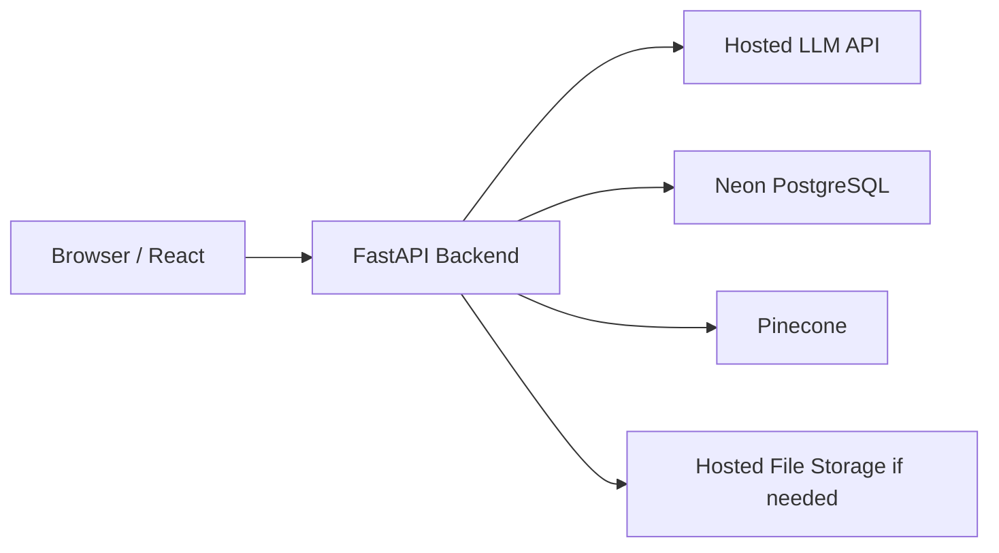

# 16. Deployment Architecture

## 16.1 Version 1 Deployment

## 16.2 Frontend

Deploy React to a managed frontend host.

## 16.3 Backend

Deploy one FastAPI application.

The application contains all feature modules and the centralized LangGraph graph.

## 16.4 Database

Use Neon PostgreSQL.

Use Alembic migrations.

Use separate development, staging, and production database environments.

## 16.5 Vector Database

Use Pinecone.

Separate environments or namespaces should prevent development data from mixing with production data.

## 16.6 Secrets

Store secrets in deployment environment variables or a secret manager.

Never commit:

- database URLs;
- API keys;
- JWT secrets;
- Pinecone keys;
- LLM credentials.

## 16.7 Workflow Execution

Business requests may outlive one HTTP request.

The backend must persist workflow state.

Version 1 may run workflow execution inside the backend process if suitable for the prototype. If production load requires it, a later version may add a managed background-job mechanism.

## 16.8 Observability

At minimum:

- structured application logs;
- request correlation by Request ID;
- error reporting;
- database migration tracking;
- workflow-stage logs;
- LLM call usage metrics without storing hidden reasoning.

## 16.9 Scaling

Scale the modular monolith vertically or with multiple stateless backend instances.

Persistent request state prevents dependence on one server's memory.

More advanced queues or services are future improvements, not initial requirements.
